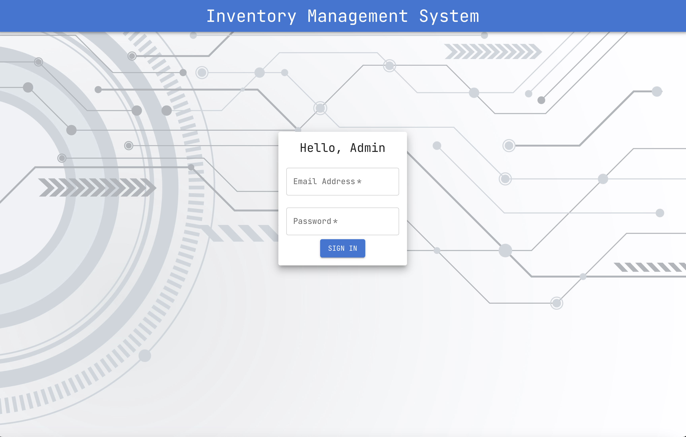
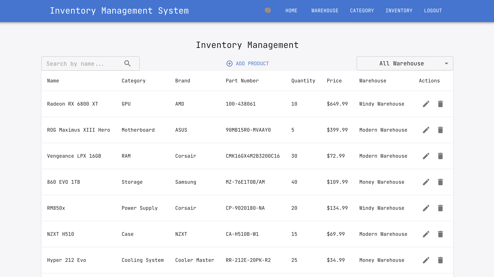

# Inventory-Management

Table of Contents
- [Description](#description)
- [Author](#author)
- [Built With](#built-with)
- [Getting Started](#getting-started)
- [Project Overview & Demos](#project-overview--demos)

 ## Description
The project aims to develop an inventory management solution tailored for company administrators to oversee and manipulate inventory across various warehouses. This encompasses functionalities for viewing, adding, deleting, and modifying inventory items. A critical requirement for the system is an intuitive and straightforward user interface, ensuring that the administrative team can efficiently perform their duties. Additionally, the application will address complex scenarios like individual warehouse capacity limits and prevent the addition of items that would surpass these thresholds. The goal is to provide a seamless and efficient inventory management experience for administrators, accommodating the specific operational needs of their warehouses.

## Author

- [**Eric Chang**](https://github.com/ESC8504)

## Built With
 
 

## Getting Started

1. **Clone the repo**

   `git clone https://github.com/ESC8504/Inventory-Management.git`

3. **Navigate to project directory**
   
   `cd your-project-name`

5. **Install necessary dependencies**
   
   `npm install`

6. **Update any example.env.example file to .env.development.local**

7. **Run the application**

   `npm run dev` and start the spring application

## Project Overview & Demos

  
   

